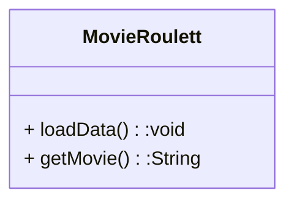
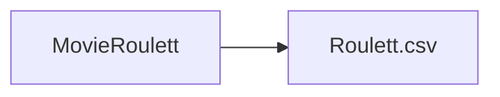

# Architecture

```mermaid
classDiagram
    class MovieRoulett{
        + loadData():void
        + getMovie():String
    }
```

The data for the MovieRoulett will be fetched from a CSV in the beginning

```mermaid
flowchart LR
    MovieRoulett --> Roulett.csv
```
