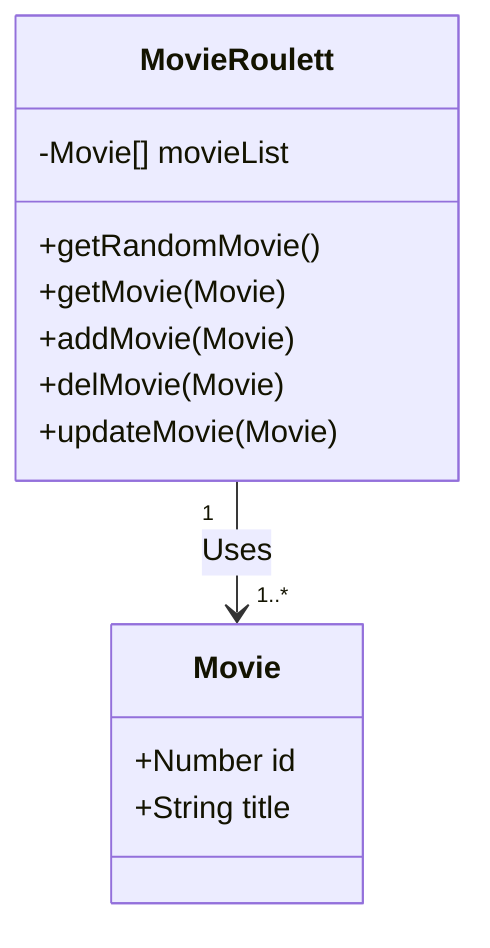

# Base Application Design


## Methods
### CRUD Operations

| Type   | Method         | Payload (data_model) | Response (data_model) |
| ------ | -------------- | -------------------- | --------------------- |
| GET    | randomMovie)() | none                 | Movie                 |
| GET    | movie()        | Movie                | Movie                 |
| POST   | addMovie()     | Movie                | Movie                 |
| UPDATE | updateMovie    | Movie                | Movie                 |
| DELETE | deleteMovie()  | Movie                | confirmation Msg      |


## Diagram



## Data Types

```ts
interface Movie {
    id: number
    name: string
}
```F
